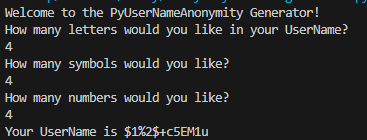

# PyUserNameGeneratorAnonymity
PyUserNameGeneratorAnonymity

# **About:**

**Made In Python**

**PyUserNameGeneratorAnonymity is a Generator UserName Anonymity with Ultra Security**

# **Download:**

  **Windows 🪟:**

  [>>>Click Here for Download<<<](https://github.com/Migq1203r/PyUserNameAnonymity/archive/refs/heads/main.zip)

  **Linux 🐧 and Mac 🍎:**
  
  ```git clone https://github.com/Migq1203r/PyUserNameAnonymity```

# **Images: 🖼️**



# **You find Me In -- (How to Contact Me ⁉️):**

  <a href="mailto:migrdev@gmail.com"></a>
